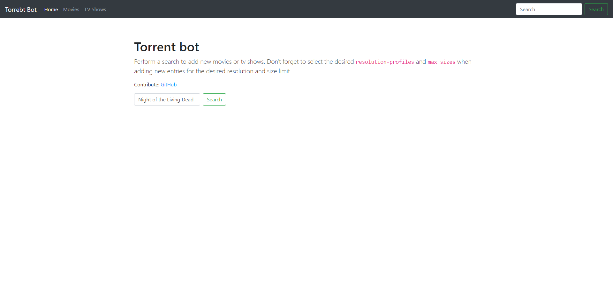
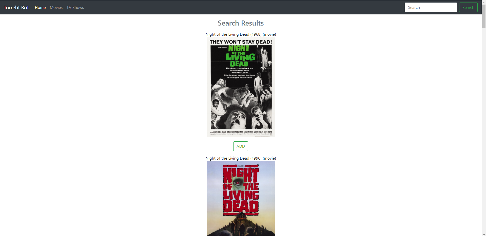
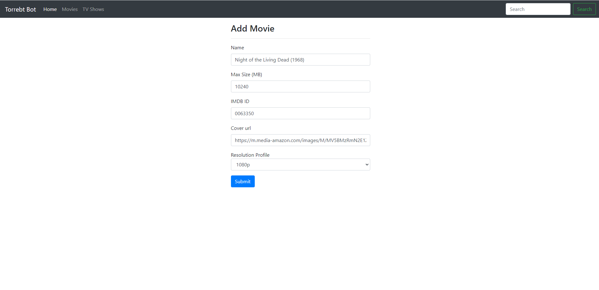

<div id="top"></div>
<!--
README based on https://github.com/othneildrew/Best-README-Template
-->

[![Forks][forks-shield]][forks-url]
[![Stargazers][stars-shield]][stars-url]
[![Issues][issues-shield]][issues-url]
[![MIT License][license-shield]][license-url]


<!-- PROJECT LOGO -->
<br />
<div align="center">
  <a href="https://github.com/afoxpod/torrent-bot">
    
  </a>

<h3 align="center">Torrent Bot</h3>

  <p align="center">
    An application for searching movies & shows and automatically download them
    <br />
    <a href="https://github.com/afoxpod/torrent-bot"><strong>Explore the docs »</strong></a>
    <br />
    <br />
    <a href="https://github.com/afoxpod/torrent-bot">View Demo</a>
    ·
    <a href="https://github.com/afoxpod/torrent-bot/issues">Report Bug</a>
    ·
    <a href="https://github.com/afoxpod/torrent-bot/issues">Request Feature</a>
  </p>
</div>


<!-- TABLE OF CONTENTS -->
<details>
  <summary>Table of Contents</summary>
  <ol>
    <li>
      <a href="#about-the-project">About The Project</a>
      <ul>
        <li><a href="#built-with">Built With</a></li>
      </ul>
    </li>
    <li>
      <a href="#getting-started">Getting Started</a>
      <ul>
        <li><a href="#prerequisites">Prerequisites</a></li>
        <li><a href="#installation">Installation</a></li>
      </ul>
    </li>
    <li><a href="#usage">Usage</a></li>
    <li><a href="#roadmap">Roadmap</a></li>
    <li><a href="#contributing">Contributing</a></li>
    <li><a href="#license">License</a></li>
    <li><a href="#contact">Contact</a></li>
    <li><a href="#acknowledgments">Acknowledgments</a></li>
  </ol>
</details>


<!-- ABOUT THE PROJECT -->
## About The Project

The torrent bot is an application that can be used for searching tv shows and movies using 
[cinamagoer](https://github.com/cinemagoer/cinemagoer). The search results can be stored, which
causes the bot to look for the respective torrents and automatically add them to a
[qbittorrent](https://www.qbittorrent.org/download.php) client.


If the movie or tv show hasn't been released yet, the bot will keep searching for it and downloads
new releases.

[![Product Name Screen Shot][product-screenshot]](https://github.com/afoxpod/torrent-bot)


### Disclaimer

Torrenting is legal if used to download uncopyrighted material, such as content that belongs to the public domain. 

Torrenting unsanctioned copyrighted material is <b>illegal</b>.

___

#### Security concerns

No security measures were put in place to protect the frontend against any type of attack. There's no TLS support,
no proper input validation on some instances and no authentication for the time being. 


<!-- GETTING STARTED -->
## Getting Started

### Pre-requisites

- [python](https://www.python.org/downloads/)
- [jackett](https://github.com/Jackett/Jackett/releases)
- [qbittorrent](https://www.qbittorrent.org/download.php)

### Installation

#### Manual setup from source

1. Create a folder named .tbot in your home directory
```commandline
mkdir $HOME/.tbot
```
2. Create a file named `config.yaml` in `$HOME/.tbot` with the following content and change the parameters
as needed.

```yaml
jackett:
  api_key: <replace_with_jacket_api_key>
  api_url: http://127.0.0.1:9117/api/v2.0

qbittorrent:
  hostname: 127.0.0.1
  port: 8080

movies:
  directory: <replace_with_the_path_were_movies_will_be_stored>
  retention_period_days: 30

shows:
  directory: <replace_with_the_path_were_shows_will_be_stored>
  retention_period_days: 30
```

3. Clone the repository

```commandline
git clone https://github.com/afoxpod/torrent-bot
```

4. Install the python requirements (use a venv if needed)

```commandline
pip install -r torrent-bot/requirements.txt
```

5. Start the application

```commandline
cd torrent-bot/src
python tbot.py
```

This need to be manually configured to run as a service. 
No current support.

#### Windows Installer

TBD

#### Linux Installer

TBD


<p align="right">(<a href="#top">back to top</a>)</p>


<!-- USAGE EXAMPLES -->
## Usage

Use the search bar to find movies or series. 





After finding a movie or tv show,
you can add it by clicking the 'add' button.



Once a show is added, you can edit it to adjust the resolution profile or maximum desired
size. 



<p align="right">(<a href="#top">back to top</a>)</p>


<!-- ROADMAP -->
## Roadmap

This was a project built for fun and leaning purposes.
No current planed roadmap :)

### Important missing features

- TV Shows are never downloaded as a whole, only season by season. This means that if individual seasons or episodes
are not available in Jackett's trackers, the series can't be downloaded. This happens because the information available
for a torrent typically doesn't include a tag indicating if it contains a full series or a single season.
We can typically identify that by looking at the torrent title, but because there's no standard naming convention 
for titles in most trackers,  we can't accurately infer that information. Additionally, a large portion of torrents
don't include the imdb id which further aggravates the problem. 
- Improved regular expressions still need to be applied to improve the accuracy of the findings. 
- There's no pagination on the frontend for the search results
- Torrent searches might be a bit slow due to [cinamagoer](https://github.com/cinemagoer/cinemagoer) poor
performance in some instances.
- The torrent updates and search for new shows/movies doesn't happen in parallel due to potential database conflicts
which need to be solved. For this reason, when a torrent is edited or deleted, it might take a while for that change to 
be reflected on the torrent state.

<p align="right">(<a href="#top">back to top</a>)</p>


<!-- CONTRIBUTING -->
## Contributing

Contributions are what make the open source community such an amazing place to learn, inspire, and create. Any contributions you make are **greatly appreciated**.

If you have a suggestion that would make this better, please fork the repo and create a pull request. You can also simply open an issue with the tag "enhancement".
Don't forget to give the project a star! Thanks again!

1. Fork the Project
2. Create your Feature Branch (`git checkout -b feature/AmazingFeature`)
3. Commit your Changes (`git commit -m 'Add some AmazingFeature'`)
4. Push to the Branch (`git push origin feature/AmazingFeature`)
5. Open a Pull Request

<p align="right">(<a href="#top">back to top</a>)</p>


<!-- LICENSE -->
## License

Distributed under the MIT License. See `LICENSE.txt` for more information.

<p align="right">(<a href="#top">back to top</a>)</p>


<!-- CONTACT -->
## Contact
Project Link: [https://github.com/afoxpod/torrent-bot](https://github.com/afoxpod/torrent-bot)

<p align="right">(<a href="#top">back to top</a>)</p>


<!-- MARKDOWN LINKS & IMAGES -->
<!-- https://www.markdownguide.org/basic-syntax/#reference-style-links -->
[contributors-shield]: https://img.shields.io/github/contributors/afoxpod/torrent-bot.svg.svg?style=flat-square
[forks-shield]: https://img.shields.io/github/forks/afoxpod/torrent-bot.svg?style=plastic
[forks-url]: https://github.com/afoxpod/torrent-bot/network/members
[stars-shield]: https://img.shields.io/github/stars/afoxpod/torrent-bot.svg?style=plastic
[stars-url]: https://github.com/afoxpod/torrent-bot/stargazers
[issues-shield]: https://img.shields.io/github/issues/afoxpod/torrent-bot.svg?style=plastic
[issues-url]: https://github.com/afoxpod/torrent-bot/issues
[license-shield]: https://img.shields.io/github/license/afoxpod/torrent-bot.svg?style=plastic
[license-url]: https://github.com/afoxpod/torrent-bot/blob/master/LICENSE.txt
[product-screenshot]: images/home_page.png
